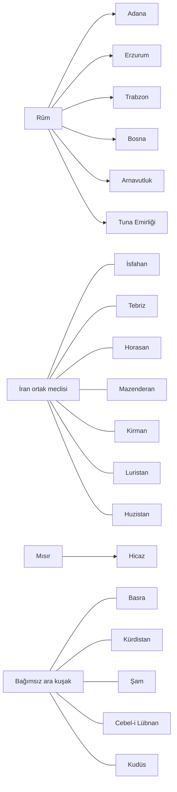

# 1836 yazılı dünya atlası

Bu belge **siyasi coğrafyanın tasarım kaynağıdır**. Şehirler ve doğal bölgelerle tarif verir; oyun state/province kimliği veya doğrulanmış sınır çizgisi vermez. Bir liman sözleşmesi çevresindeki bütün eyaleti yabancı ülkeye devretmez. Egemenlik ile hak iddiası ayrı sütunlarda tutulur.

**Gösterim:** doğrudan toprak = merkezî ülke egemenliği; özerk bağlı = ayrı yerel yönetim ve sözleşmeli dış yükümlülük; bağımsız = üst devleti yok; ortak taç = hanedan ortaklığı, ülke ilhakı değil. Ayrıntılı yükümlülükler [diplomasi](diplomasi.md) belgesindedir.

## 1. Ortadoğu ve Balkanlar

| Siyasi birim | Başkent / merkez | 1836 doğrudan coğrafyası | Statü ve sınır meselesi |
|---|---|---|---|
| Rûm İmparatorluğu | Konstantiniyye; Konya tarihî merkez | Trakya, Makedonya–Selanik, Teselya ve güney Yunanistan; batı/orta Anadolu; atabeylikler dışındaki Anadolu; Halep ve kuzey Suriye; Bağdat–orta Dicle/Fırat; Kıbrıs ve ana Ege adaları | Doğu atabeylikleri, Bosna/Arnavutluk/Tuna doğrudan boya alanına katılmaz. Girit Rûm'dadır; Malta, Batı Sicilya, Güney Sardinya ve Septe (Ceuta) denizaşırı deniz üsleridir ([P3](../../scenarios/atlas/political_p3_borders/README.md)). |
| Bosna Emirliği | Saraybosna | Bosna ve iç Hersek | Rûm'a bağlı; Adriyatik'teki bütün Dalmaçya onun değildir. |
| Arnavutluk Emirliği | İşkodra | Arnavutluk ve sözleşmeyle yönetilen komşu yaylalar | Rûm'a bağlı; kent–aşiret dengesi ve sınır hayvancılığı önemli. |
| Tuna Emirliği | Tırnova | Bulgar çekirdeği, Tuna'nın güneyindeki ova | Rûm'a bağlı; bütün Bulgar halkı Müslüman veya tek siyasi görüşte sayılmaz. 1827'de Dobruca'yı Eflak'a kaybetti ([P3](../../scenarios/atlas/political_p3_borders/README.md)). |
| Sırbistan Krallığı | Belgrad | Morava havzası ve merkezî Sırp bölgeleri | 25 Eylül 2026 kararıyla Rûm'a bağlı ([P2](../../scenarios/atlas/political_p2_corrections/README.md)); Bosna sınırında hak iddiaları var. |
| Eflak Prensliği | Bükreş | Tuna'nın kuzeyi, güney Karpat etekleri ve Dobruca | 1818–1827 savaşında Lehistan'ın Rûm'u yenmesiyle Lehistan korumasına girdi; Dobruca ile Tuna ağzını aldı ([P3](../../scenarios/atlas/political_p3_borders/README.md)). Rûm tabiisi değil. |
| Boğdan Prensliği | Yaş | Doğu Karpatlar ile Prut çevresi | Lehistan koruma antlaşmasına bağlı; iç vergi ve din işleri kendisinde. Besarabya 1827'den beri Lehistan'ın doğrudan toprağı ([P3](../../scenarios/atlas/political_p3_borders/README.md)). |
| Macaristan Krallığı | Buda | Pannonya'nın ana havzası | Bağımsız; Habsburg kişisel birliği yok. 1818–1827 savaşında Erdel'le birlikte serbest kaldı; Hırvatistan'ı (Dalmaçya dahil) kukla tutar, Erdel'le Karpat Ahdi'ne bağlı ([P3](../../scenarios/atlas/political_p3_borders/README.md)). |
| Erdel Prensliği | Kolozsvár | Karpat iç havzası | Bağımsız; Macar, Rumen ve Sakson seçkinlerin müşterek meclisi. Macaristan'la 1827 Karpat Ahdi savunma paktı ([P3](../../scenarios/atlas/political_p3_borders/README.md)). |
| Adana Atabeyliği | Adana | Çukurova, Mersin limanı, güney Toros geçitleri | Rûm'a bağlı. Halep onun toprağı değil; vergi ve geçit tarifesi ihtilaflı. |
| Erzurum Atabeyliği | Erzurum | Erzurum–Erzincan yüksek havzaları, Kars sınır hattı | Rûm'a bağlı. Erevan kendi egemen bölgesi değil. |
| Trabzon Atabeyliği | Trabzon | Doğu Karadeniz kıyısı ve limanın bağlı vadileri | Rûm'a bağlı. Erzurum ile liman geçişi konusunda ayrı pazarlık yapar. |
| Musul Emirliği (eski Kürdistan Emirliği) | Musul | Musul ve bağlantılı dağlık kuşak | Bağımsız. 25 Eylül 2026 kararıyla Diyarbakır Rûm'a geçti ve "Kürdistan" devleti kalktı ([P2](../../scenarios/atlas/political_p2_corrections/README.md)). Urmiye Tebriz'de. Oyunda vanilla "Kürdistan" adı görünüyordu; [P4](../../scenarios/atlas/political_p4_corrections/README.md) ile düzeldi. |
| Basra Cumhuriyeti | Basra | Şattülarap, alt Mezopotamya deltası ve körfez limanı | Bağımsız tüccar-eşraf meclisi. Bağdat onun değil; nehir geçişine muhtaç. |
| Şam Emirliği | Şam | Şam, Humus ve Hama iç koridoru; Lübnan/Kudüs dışındaki güney Suriye | Bağımsız; Mısır'ın tarihî iddiası egemenlik değildir. |
| Cebel-i Lübnan Emirliği | Beyrut; dağ meclisi ayrı | Lübnan dağları, Beyrut ve bağlı kıyı | Bağımsız; liman tüccarları ve dağ hanedanları arasında ikili düzen. |
| Kudüs Emirliği | Kudüs | Filistin içi, Gazze ve Akka'ya açılan kıyı | Bağımsız; kutsal yerlerin çok taraflı vakıf hakları toprağın müşterek sahipliği değildir. |
| Mısır Sultanlığı | Kahire | Nil deltası, Nil vadisi, Sina; güneyde Dongola'ya uzanan nehir koridoru | Bütün Sudan veya Eritre Mısır sayılmaz. Nil yönetimi ile kıyı ticaret imtiyazları farklıdır. |
| Hicaz Şerifliği | Mekke; Cidde limanı | Hicaz kıyısı ve kutsal kentler | Mısır'la koruma antlaşması; doğrudan Mısır eyaleti değil. |
| Cebel Şammar / Necid | Hail / Riyad | İç Arabistan'ın iki ayrı çekirdeği | İkisi de bağımsız; vahalar arası etki sınırları tek tip dolu renk olarak düşünülmez. 26 Eylül 2026: Cebel Şammar'ın Hail batısındaki Cevf–Tebük–Teyma çölü Şam Emirliği'nde; el-Hasa kıyısı Bahreyn ve Hasa Emirliği'nde ([P4](../../scenarios/atlas/political_p4_corrections/README.md)). |
| Yemen İmamlığı ve kıyı yönetimleri | Sana; Aden, el-Mukalla ve el-Mehre ayrı liman merkezleri | Zeydi imamlık Yemen yaylalarında; Lahic Aden kıyısında, Mahra ve Kathîr doğu kıyı ağlarında | Hepsi bağımsız yerel yönetimlerdir; Hicaz'ın Yemen'de toprağı yoktur. Aden'in ticari özerkliği Lahic sahibiyle temsil edilir. Mahra, Hadramut Sultanlığı'yla birleşti (Umman koruması) ([P4](../../scenarios/atlas/political_p4_corrections/README.md)). |
| Umman Sultanlığı | Maskat | Umman kıyısı, Laristan kıyı bağı ve iç bölgelerle anlaşmalı bağ; Zanzibar tacın denizaşırı merkezi | İbadi yönetim; Kahire'nin tabiisi değil. Abu Dabi, Makran/Bampur ve Mombasa'da sözleşmeli liman erişimi vardır, doğrudan toprağı yoktur. |
| Körfez emirlikleri | Kuveyt, Manama, Abu Dabi ayrı merkezler | Liman ve vaha hinterlantları | Bağımsız küçük aktörler; Basra, İran ve Umman arasında ticari rekabet. Bahreyn, Katar ve el-Hasa kıyısını tutan Bahreyn ve Hasa Emirliği'dir ([P4](../../scenarios/atlas/political_p4_corrections/README.md)). |

### İran'ın yedi üyesi

| Üye | Merkez ve coğrafya | Ayrı çıkar |
|---|---|---|
| İsfahan Şahlığı | İsfahan; merkezî plato, Kum–Kaşan bağlantıları ve Fars/Şiraz | Ortak tarife ve diplomaya dayalı merkezîleşme; bütün İran nüfusu buraya yazılmaz. |
| Tebriz Şahlığı | Tebriz; İran Azerbaycanı, Urmiye | Hassas imalat, sınır ticareti, ortak borç üzerindeki veto 26 Eylül 2026'dan beri İsfahan'ın kuklası; Bakü ve Erevan İsfahan'ın korumasında ([P4](../../scenarios/atlas/political_p4_corrections/README.md)). |
| Horasan Devleti | Meşhed; Horasan, doğu kervan geçitleri | Tahıl, süvari ve Orta Asya gümrükleri |
| Mazenderan Şahlığı | Sari; güney Hazar kuşağı | İpek, orman ürünleri, yerel vergi özerkliği |
| Kirman Emirliği | Kirman; güneydoğu plato, Bender Abbas'a ticari çıkış | Bakırcılık, su kıtlığı, körfez tarifeleri |
| Luristan Yönetimi | Hürremabad; batı Zagros | Yayla toplulukları, geçiş gelirleri ve merkezî kadastroya direnç |
| Huzistan Emirliği | Şuşter; Karun havzası ve körfezin doğu kıyısı | Sulama ve nehir taşımacılığı; Basra ile komşu, Basra'nın sahibi değil |

Bakü, Kürdistan, Basra ve Beluç devletleri konfederasyonun **dışındadır**. Kirman ve Huzistan sayesinde İran'ın deniz erişimi vardır; sorun “tamamen karaya kapalı” olması değil, ortak deniz/tarife politikasının zayıflığıdır.

## 2. Kafkasya, bozkır ve Orta Asya

| Birim | Egemen çekirdek | Tasarım sınırı |
|---|---|---|
| Gürcistan Krallığı | Tiflis, batı Gürcistan ve bağlantılı vadiler | Bütün Güney Kafkasya değildir; dağ toplulukları ve kilise ayrı güçlerdir. |
| Erevan Prensliği | Aras çevresi, Erevan havzası | Bağımsız küçük Ermeni ağırlıklı tampon; İran ve Rûm hak iddia eder. |
| Bakü Hanlığı | Abşeron, Şirvan kıyısı | Bağımsız; 1836 gücü liman/tuz/tekstil ticaretidir, modern petrol zenginliği değil. |
| Dağıstan imametleri / Çerkes birlikleri | Kuzeydoğu / kuzeybatı Kafkasya | İki farklı siyasi ağ; tek merkezin bütün dağları denetlediği varsayılmaz. |
| Kırım Hanlığı | Kırım yarımadası ve yakın bozkır kıyısı | Bağımsız; Karadeniz ihracatı ve köle ticaretinin tasfiyesi iç mesele. |
| Büyük Tatar Hanlığı | Kazan–orta Volga, Ural ve Başkurt toprakları, aşağı havzadaki anlaşmalı geçitler | Ural Konfederasyonu ile Çuvaşya doğrudan hanlıktadır; Kazak Hanlığı ve Sibirya Tatarları haraç veren koruma devletleridir ([P3](../../scenarios/atlas/political_p3_borders/README.md)). Sibirya'nın tamamı hanlık değildir. |
| Kalmuk Hanlığı | Aşağı Volga'nın doğu bozkırı | Ayrı Budist yönetim; Tatarlarla otlak ve geçiş anlaşmaları. |
| Moskova Knezliği (Büyük Prenslik) | Moskova–üst Oka çekirdeği | Tatar askerî ve ticari baskısı doğuya yayılmasını sınırlar. Sibirya’ya uzanan büyük Rusya yoktur; baskı burada resmî tâbilik ilanı değildir. |
| Novgorod Cumhuriyeti | İlmen havzası, kuzeybatı ticaret bağlantıları | Bağımsız; Moskova'nın otomatik tabiisi değil. |
| Mari / Mordvin yönetimleri | Orta Volga–orman geçiş kuşağının ayrı toplulukları | Moskova–Tatar rekabetinde bağımsız anlaşmalı aktörler. |
| Kazak Hanlığı | Türkistan (Sırderya); Uralsk'tan Semey'e bozkır | Üç cüz 25 Eylül 2026 kararıyla tek hanlıkta birleşti; Tatar Hanlığı'na haraç veren koruma devleti ([P3](../../scenarios/atlas/political_p3_borders/README.md)). Yedisu Uygur Hanlığı'ndadır. Ural'ın batı yakası (Bukey bozkırı) Tatar'da ([P4](../../scenarios/atlas/political_p4_corrections/README.md)). |
| Buhara / Hive / Hokand | Zerefşan / Harezm / Fergana | Üç bağımsız yönetim; İran'a asker/vergi tabiiyeti yok. Buhara Merv, Maymana ve Kunduz'u; Hive Türkmen çölünü; Hokand Kırgız birliklerini doğrudan tutar ([P3](../../scenarios/atlas/political_p3_borders/README.md)). |
| Uygur Hanlığı | Kaşgar; Tarım havzası, Cungarya, Altay, Yedisu, Gansu (Hexi koridoru), Çinghay ve Hindukuş'ta Chitral–Kafiristan | 25 Eylül 2026 kararıyla tek ve büyük hanlık ([P3](../../scenarios/atlas/political_p3_borders/README.md)). Kuzey Çin'e karşı baskıcıdır: Çinli çoğunluklu Gansu'yu yönetir, Ningxia ve Çinghay'a hak iddia eder, Kuzey Çin'le rakiptir. Moğolistan onun değil. Çinghay ve Hindukuş [P4](../../scenarios/atlas/political_p4_corrections/README.md) ile eklendi. |
| Kırgız birlikleri | Tanrı Dağları'nın yüksek geçitleri | Hokand'a katıldı ([P3](../../scenarios/atlas/political_p3_borders/README.md)); Kırgız toplulukları Hokand ve Uygur topraklarında yaşar. |
| Herat / Kabil / Kandahar | Horasan sınırı / Kabil havzası / güney Afgan geçitleri | Üç bağımsız Afganistan aktörü; Gurkanî–Horasan pazarlığına açık. |
| Beluç hanlıkları | Kelat ve Makran'ın ayrı iç/kıyı ağları | Liman hakları egemenlik devri sayılmaz. |
| Sibirya ve kuzeydoğu halkları | Ob–Yenisey, Baykal ve uzak kuzeydoğuda yerel siyasi alanlar | Haritada “Moskova yoksa boş” kabul edilmez; kesin oyun sahibi `SIYASI_STATE_KARAR_DEFTERI.md` ve Kart 0/6B ile belirlenir. |

## 3. Avrupa ve Akdeniz

| Bölge | 1836 düzeni | Sınır ve kimlik kararı |
|---|---|---|
| Endülüs | Kurtuba merkezli federal taç; güney ve orta İberya, batıda Lizbon kıyısına erişim | Başkent Kurtuba'dır; Sevilla/İşbiliye başlıca tersane. Kuzey krallıkları ve Mağrip ayrı. |
| Kuzey İberya | Kastilya: Burgos–kuzey iç yayla; Aragon: Zaragoza–Barcelona/doğu kuzey kıyı; Galiçya: kuzeybatı ve Porto çevresi; Navarra: Pamplona/Bask geçitleri | İspanya ve Portekiz adında birleşik devlet yok. Portekizce konuşan topluluklar yaşamaya devam eder. |
| Fransız ülkeleri | Paris: Seine–Loire'ın merkez/kuzey çekirdeği; Burgonya: Dijon–Saône; Bretonya: yarımada; Akitanya: Bordeaux–Garonne/Gaskonya; Oksitanya: Toulouse–Languedoc; Provence: Rhône ağzı–Marseille | **Altı bağımsız devlet.** Paris'in unvan iddiası diğer beşini vassal yapmaz. Lyon/Rhône tarifeleri Burgonya–Provence anlaşmazlığıdır. |
| Alçak Ülkeler | Hollanda denizci birlik; Brabant kentleri ve Liège ayrı yönetimler | Tarihsel Belçika kuruluşu otomatik korunmaz. Hollanda'nın yüksek ticaret kapasitesi bütün hinterlandın sanayileşmesi değildir. |
| Alman İmparatorluğu | Bavyera imparatorluk tacını taşır. Avusturya, Bohemya, Brandenburg, Saksonya, Hannover, Ren kent birliği, Hessen, Baden, Württemberg, Anhalt, Mecklenburg, Pomeranya ve Baltık Prusya Dükalığı ayrı siyasal aktörler | Bavyera bunların üst devleti değildir. Prusya birleşmesi gerçekleşmedi: Batı Prusya Lehistan-Litvanya'nın Baltık koridorudur; Doğu Prusya bağımsız dükalıktır; Silezya Bohemya'dadır. Schleswig–Holstein, Kalmar tahtına bağlı özerk düklüklerdir; hem Alman bağımsız ülke hem doğrudan Kalmar eyaleti sayılmaz. 25 Eylül 2026: Hamburg–Bremen–Lübeck tek Hansa Kent Birliği, Thüringen düklükleri Thüringen Birliği, Hessen kolları tek Hessen oldu; küçük prenslikler komşularına katıldı. Avusturya 1818–1827 savaşında İstirya, Güney Tirol, Dalmaçya ve Bukovina'yı kaybetti ([P3](../../scenarios/atlas/political_p3_borders/README.md)). |
| İsviçre | Kanton konfederasyonu | Karma mezhep ve farklı kent/kır çıkarları; bütünü Katolik veya bütünü demokratik değil. |
| Kuzey İtalya | Savoy–Piyemonte, Milano, Venedik, Ceneviz; Toskana ve Modena | Denizci cumhuriyetlerin gücü doğu ticaretinin “bitmesi” yüzünden sıfırlanmaz; güçlü rakip ve ayrıcalık kaybıyla sınırlanır. Ceneviz Liguria kıyısı ve Korsika'yı, Venedik İstirya ve Güney Tirol'ü tutar; Parma Milano'ya, Lucca Toskana'ya katıldı ([P3](../../scenarios/atlas/political_p3_borders/README.md)). |
| Orta/güney İtalya | Toskana/Floransa, Papalık Devleti, Napoli; Sicilya–Sardinya ortak tacı | Napoli anakara güneyini, Sicilya–Sardinya Tacı Palermo ile doğu Sicilya'yı ve kuzey Sardinya'yı tutar. 25 Eylül 2026 kararıyla Rûm'un deniz üsleri Batı Sicilya (Trapani–Mazara), Güney Sardinya (Cagliari) ve Malta'dır ([P3](../../scenarios/atlas/political_p3_borders/README.md)). |
| Britanya | İngiltere–Galler tacı Londra'da; İskoçya Edinburgh meclisiyle aynı hükümdarı tanır; İrlanda kendi alt tacı ve meclisiyle aynı düzene bağlı | “Britanya” birleşme projesi/ortak dış politika adıdır. İskoçya aynı anda ilhak edilmiş ve bağımsız rakip sayılmaz. Kolonilerin üst makamı Londra'dır. |
| Kalmar | Danimarka, Norveç ve İsveç'in kalıcı ortak tacı; merkezî dış kurul Kopenhag'da | İsveç, Danimarka'nın koloni tipi tabiisi değildir. Finlandiya İsveç tacı içinde özel diyet; İzlanda Norveç tacında. |
| Lehistan–Litvanya | Varşova ortak sejm; Leh, Litvan, Doğu Galiçya ve doğu Ruthen bölgeleri | Avrupa’nın gecikmesinden en az etkilenen Hristiyan devlet; Rûm’la çatışma ve teknik aktarım sayesinde güçlüdür. Batı Galiçya Kraków şehir devleti çevresinde ayrı kalır; Boğdan ayrı koruma devletidir. 1818–1827 savaşında Rûm'u ve Avusturya'yı yenerek Bukovina ve Besarabya'yı aldı, Eflak'ı koruması altına aldı. Bağımsız Livonya Konfederasyonu'na İsveç'le birlikte göz diker; iki devlet rakiptir ([P3](../../scenarios/atlas/political_p3_borders/README.md)). |

**Kuzey Avrupa'nın gelişmişliği:** Kalmar taçları denizcilik, metal ve temel okul ağlarında Avrupa'nın görece güçlü kesimidir. Teknik eğitim ve makineleşme birkaç merkezle sınırlı, kırsal yükümlülükler ve lonca hakları etkilidir. Danimarka, İsveç ve Norveç'in mevcut coğrafi/kurumsal karakterleri korunur; yeni bir büyük kuzey tarih kırılması eklenmez.

**Alman dinî düzeni:** Bavyera, Avusturya, Bohemya, Baden ve Württemberg Katolik makamları; Brandenburg, Saksonya, Hannover, Anhalt, Mecklenburg ve Pomeranya reform kilisesi makamları taşır. Hessen ve Ren kentlerinde karma kamusal uzlaşma vardır. Bu resmî düzenler halkın tamamına tek din atamak değildir.

**Küçük Alman/İtalyan birimler:** yukarıdaki kuşaklar onların silinmesi talimatı değildir. Dünya taslağı ana aktörlerini ve hukuki çerçevelerini tanımlar; kesin küçük prenslik listesi, ülke kimlikleri ve province sınırları [siyasi state karar defterinde](SIYASI_STATE_KARAR_DEFTERI.md) kilitlidir. Arşivdeki “171” sayısını tutturmak için devlet icat edilmez veya silinmez.

## 4. Hindistan

| Devlet/ağ | 1836 çekirdeği | Açık sınır kararı |
|---|---|---|
| Gurkanî İmparatorluğu | Delhi, yukarı Ganj–Yamuna, Lahor ve orta Pencap; doğu Sind bağlantısı | Bütün Pencap, Gujarat ve Hindistan onun değildir. Lahor Gurkanî merkezinde kalır. 26 Eylül 2026: Bundelkhand, Bhopal, Alwar, Garhwal ve Bahawalpur doğrudan Gurkanî'de; Jodhpur da koruması. Hindistan'da küçük prenslikler komşularına katıldı, devlet sayısı yaklaşık 60'tan 26'ya indi ([P4](../../scenarios/atlas/political_p4_corrections/README.md)). |
| Sih Devleti | Amritsar, kuzey/doğu Pencap ve dağ etekleri | Gurkanî ile Lahor üzerinde iddiası var; aynı toprak iki tarafa verilmez. |
| Keşmir Krallığı | Srinagar ve vadi | Gurkanî'ye sözleşmeli bağlı; Sih nüfuzuna açık. |
| Sind Emirlikleri | Haydarabad-Sind, Karaçi ve aşağı İndus | Batı/aşağı Sind'de bağımsız birlik; Gurkanî'nin tamamını tuttuğu eski cümle geçersiz. |
| Gujarat liman birliği | Surat–Kathiawar kıyıları | Tüccar yönetimleri; bazı limanların Gurkanî vergi bağı ayrı sözleşmeyle sınırlı. Gujarat'ın tamamı Maratha veya Gurkanî değildir. |
| Racput devletleri | Jaipur, Jodhpur, Udaipur ve komşu hanedan alanları | Ayrı devletler; Gurkanî korumasını tanıyanlarla tanımayanlar ayrılır. |
| Awadh | Lucknow ve orta Ganj | Bağımsız; Gurkanî'yle hanedan yakınlığı dış egemenliği devretmez. |
| Bengal Sultanlığı | Dakka, aşağı Ganj/Brahmaputra ve Kalküta limanı | İngiliz hükümeti ve Doğu Hindistan Şirketi devleti yok. Avrupa ticarethaneleri egemen devlet değil. |
| Maratha Konfederasyonu | Pune ve batı Dekkan; Gwalior, Indore, Nagpur gibi ortaklar | Pune'nin bütün ortak toprakları doğrudan yönettiği varsayılmaz. |
| Haydarabad | Dekkan'ın merkez/doğu kesimi | Bağımsız çok dinli hanedan devleti. |
| Mysore | Mysore–Bengaluru platosu | Bağımsız; güçlü yerel askerî imalat. |
| Travankor–Koçin / Tamil krallıkları | Güneybatı kıyı / Tamil ovaları | Ayrı yerel yönetimler; boş İngiliz alanları olarak kalmaz. |
| Nepal / Bhutan / Assam | Katmandu / Bhutan vadileri / Brahmaputra'nın yukarı havzası | Bağımsız dağ ve nehir siyaseti; Bengal'in otomatik devamı değil. |
| Kandy Krallığı | Sri Lanka'nın içi ve yerel liman sözleşmeleri | Egemen ada devleti; tamamı İngiliz/Seylan kolonisi değil. |

## 5. Çin, Doğu Asya ve denizler

| Birim | Çekirdek ve yönetim | Tasarım meselesi |
|---|---|---|
| Kuzey Çin İmparatorluğu | Pekin; Sarı Nehir ovası ve kuzey iç kesimler | Çing sonrasında yeni kuzey hanedanı; Mançurya'nın sahibi değil. Gansu'yu Uygur Hanlığı'na kaybetti ve geri ister ([P3](../../scenarios/atlas/political_p3_borders/README.md)). |
| Jiangnan Cumhuriyeti | Nankin; Şanghay ve aşağı Yangtze havzası | Mülk ve lonca temsiline dayalı bürokrat-tüccar cumhuriyeti; genel oy yok. |
| Shu Krallığı | Chengdu; Siçuan havzası ve komşu dağ geçitleri | Güçlü tarım ve savunma; yalnız yoksul/yalıtılmış “dağ ülkesi” değil. |
| Yue Konfederasyonu | Guangzhou; Guangdong, Guangxi ve güney kıyı ağları | Ticari ve bölgesel kurullar; Fujian kıyısındaki yerel meclislerle ayrı gümrük uzlaşması. Fujian'daki Zeytun (Quanzhou) limanında yaklaşık 800 bin kişilik Müslüman tüccar cemaati yaşar; ayrı bir devlet değildir ([P3](../../scenarios/atlas/political_p3_borders/README.md)). |
| Mançurya Hanlığı | Mukden | Eski Çing seçkinlerinin çekirdeği; yerel halklar ve yerleşimci çiftçiler ayrı çıkarlar taşır. |
| Yunnan–Guizhou / Hunan–Hubei sınır kuşakları | Yerel yönetimler sırasıyla Shu / Jiangnan dış çatısı altında geniş özerklikle | Çin'in kalan içi sahipsiz bırakılmaz; fiilî egemenlik ile bütün Çin taht iddiası ayrılır. |
| Moğol hanlıkları | Cungarya dışı batı/orta/doğu otlak ittifakları | Kuzey Çin ve Mançurya ile farklı bağlar; topluca Kaşgar'a verilmez. |
| Tibet | Lhasa ve yüksek plato | Bağımsız dinî-siyasi yönetim; Çin devletlerinin iddiası fiilî sahiplik değildir. |

Jiangnan'ın yazılı “aşağı Yangtze” çekirdeği siyasi haritada Hunan, Hubei ve Jiangxi'yi de **doğrudan** yöneten ülkenin tümü değildir. Bu dış bölgelerin geniş yerel özerkliği ayrı egemen tag veya ikinci hazine yaratmaz. Uygur Hanlığı (eski Kaşgar) Tianshan, Cungarya, Altay, Yedisu ve Gansu'yu doğrudan yönetir; Moğol otlakları onun değildir ([P3](../../scenarios/atlas/political_p3_borders/README.md)).
| Japonya / Kore | Tokugawa bakufusu ve hanlar / Joseon | İç düzenlerinde büyük alternatif dönüşüm yok; değişen Çin yönetimleri ve denizci muhataplara uyum var. Batılı müdahaleye bağlı tarihsel olaylar otomatik tekrarlanmaz. |
| Ryukyu | Naha ve ada zinciri | Japon ve Yue ticaret heyetlerine çifte haraç geleneği; tek bir askerî üst devlet yok. |
| Vietnam / Siam / Burma | Bölgesel hanedanlar; Lao, Khmer ve Şan yönetimleriyle eşitsiz anlaşmalar | Yerel düzen büyük ölçüde korunur. Dış sömürge baskısının kaynağı Batılı Hristiyan güçler yerine Müslüman denizci güçlerdir. |
| Aceh / Johor / Minangkabau | Sumatra ve Malay boğaz ağları | Müslümanlık Kahire tabiiyeti anlamına gelmez. |
| Java sarayları / Bali / Borneo kıyı sultanlıkları / Makassar–Maluku | Ada merkezleri ve iç yerel yönetimler | Müslüman dış güçlerin şirket, üs ve sömürge baskısı vardır. Mevcut yerli çekirdekler korunur; kesin kıyı kolonileri ayrıca kaydedilmeden ada çapında yabancı egemenlik atanmaz. |
| Tondo / Visaya liman birlikleri / Sulu | Luzon / orta Filipin adaları / güney takımadalar | Üç farklı siyasi-dinî alan; bütün Tagalog/Visaya halkları Müslüman sayılmaz. |
| Avustralya | Yerel toplulukların toprakları; kuzeyde mevsimlik Makassar ve Mısır destekli ticari iskeleler | Kıta egemen koloni değil. Küçük yabancı yerleşimlerin hukuk sınırı kıtanın devri değildir. |
| Aotearoa | Māori iwi/hapū ağları; kuzeyde gelişmekte olan dış ticaret meclisi | Bütün adaları erken tarihte birleştirmiş tek Māori devleti yok. |
| Pasifik adaları | Hawaii, Tonga, Samoa, Tahiti ve diğer yerel siyasi alanlar | Yerel devlet ve topluluklar korunur; tarihsiz otomatik Avrupa ilhakı yok. |

**Samoa'nın etkin sınırı:** [Okyanusya diliminde](../../scenarios/atlas/demography_phase16_oceania/README.md) kurulu `STATE_TONGA` içindeki Tafuna ve Apia/Salelologa hub province'leri `VSM` Samoa Meclisi'ne ayrılır; Tonga diğer iki province'i tutar. Bu, aynı state'in kaynaklarını paylaşan iki bağımsız yerel siyasi alandır, Tonga'ya yeni bir vasallık bağı değildir.

**Güneydoğu Asya'da sömürge katmanı:** yerli Müslüman sultanlıkların varlığı tek başına “Müslüman kolonicilik” değildir. Dış güç olarak Mısır ve Umman'ın desteklediği filolar/şirketler öne çıkar; yerel Müslüman, Budist, Hindu ve diğer yönetimlerle eşitsiz ilişkiler kurabilirler. 1836 portföyü sınırlıdır: Mısır'ın Aceh'te (1824) ikmal/ambar, Makassar'da (1821) tamir/ambar sözleşmesi; Umman'ın Johor'da (1828) konvoy/tarife, Sulu'da (1829) silah/geçiş sözleşmesi vardır. Bunların hiçbiri state sahipliği, subject veya ada çapında koloni değildir. Batılı Hristiyan sömürgecilik ana etken olarak çıkarılır; yerel Hristiyan toplulukların sırf bu yüzden silinmesi istenmez.

**Pegu düzeltmesi:** Kurulu oyundan siyasi karta taşınmış tek province'lik Danimarka (`DEN`) Pegu payı, bu ilkeye aykırı kalan eski bir egemenlikti. [Anakara demografi diliminde](../../scenarios/atlas/demography_phase13_mainland_seasia/README.md) province ve 9.102 Mon/animist sakin Burma'ya geçirildi. Bu, Mısır/Umman liman sözleşmelerini toprak devrine çevirmez.

**Tranquebar düzeltmesi:** Aynı ilkeyle Madras'taki tek province'lik Danimarka payı [Ortadoğu–Hindistan demografi diliminde](../../scenarios/atlas/demography_phase26_middle_east_india/README.md) Tamil krallığına katıldı; 34.313 sakin ve küçük Danimarkalı tüccar topluluğu korunur.

**Filipin kimlik düzeltmesi:** [Deniz demografi dilimi](../../scenarios/atlas/demography_phase14_maritime_seasia/README.md) Tondo ve Visaya birliklerinin devralınmış Katolik resmî dinini yerel inançların oyun karşılığına geçirir; başlangıç halkında yerel inanç çoğunluğu ile daha küçük Katolik cemaatler birlikte yaşar. Sulu/Maguindanao'nun Müslümanlığı diğer Filipin halklarına otomatik yayılmaz. Siyasi sınır veya Mısır/Umman liman sözleşmesi değişmez.

Afrika ve Amerika'nın egemen çekirdekleri kendi [Afrika](senaryo_afrika.md) ve [Amerika](senaryo_amerika.md) belgelerindedir. Bu atlas onları tekrar çizmez.

## 6. Ölçeksiz Ortadoğu siyasi şeması

Ok yalnız bağlılık yönünü gösterir; mesafe, sınır veya askerî ittifak haritası değildir. “Ortak” çizgi konfederasyon üyeliğidir.

“Ara kuşak” gerçek bir ittifak veya ülke değildir; bağımsız aktörleri şemada gruplayan başlıktır.

## 7. Siyasi harita kilidi

Her tartışmalı sınırın son province çizgisi artık [siyasi state karar defterinde](SIYASI_STATE_KARAR_DEFTERI.md) ve onu üreten Atlas kartlarında kayıtlıdır. Halep–Şam–Adana, Erzurum–Erevan–Kürdistan, Lahor–Sih devleti, Endülüs–kuzey İberya, Yeni Endülüs–Maya ve Kalmar–yerli kuzey ticaret alanları bu kayıtla tek doğrudan sahibine bağlanır. Ticaret yolu, liman hakkı ve yerel toplum bağları sınırın ikinci sahibi değildir.

Bu belge kıtasal neden-sonucu; karar defteri ise oyun haritasındaki kesin çizimi taşır. Sınır değişikliği iki belgeyi, komşu kartları ve diplomasiyi birlikte güncellemeden yapılamaz.
