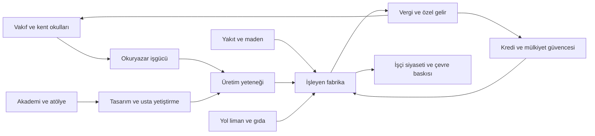

# Ekonomi, nüfus ve toplum — 1836 tasarım hedefleri

Bu rakamlar alternatif evren için **başlangıç dengeleme hedefleridir**. Tarihsel istatistik, motorun hesapladığı GDP/yaşam standardı veya onaylanmış eyalet nüfusu değildir. İlk veri hazırlığında kaynak kapasitesi ve toplamlar denetlenip revize edilir. “Doğu ileri” ifadesi her eyalete fabrika veya yüksek okuryazarlık vermek için kullanılmaz.

## 1. Sanayileşmenin coğrafyası

| Üretim havzası | Yaptığı iş | Temel girdiler ve dış bağ | 1836 darboğazı |
|---|---|---|---|
| Marmara–Bursa–Konstantiniyye | Dokuma, makine/alet, tersane, askerî tedarik | Anadolu/Karadeniz kömürü, iç Anadolu tahılı, Mısır/Çukurova pamuğu, İran hassas parçaları | Kömür sevki, savaş borcu, kent gıdası ve kamu siparişlerine bağımlılık |
| Konya–Kayseri iç kuşağı | Tarım araçları, yün, bölgesel imalat | Tahıl, yün, kereste, Marmara makineleri | Limana uzaklık, su ve yol bakım gideri; bir kıyı sanayi havzasıyla aynı verim değil |
| Ereğli–Karadeniz maden kıyısı | Kömür, maden tahliyesi, yakıt taşımacılığı | Sermaye, pompa, liman, işgücü ve gıda | Maden kazası, taşıma kaybı, bakım ustası; kömür varlığı sınırsız ucuz enerji değildir |
| Tebriz–Urmiye | Hassas alet, metal, silah, boyalı dokuma | Maden, odun kömürü/taşkömürü tedariki, su gücü, kent becerisi | Sınır gümrüğü, yakıt mesafesi ve ortak borç anlaşmazlığı |
| İsfahan–Kaşan–Şiraz | Eğitim, ipek, basım, kimyasal işlem ve özel imalat | Vakıf/ortaklık sermayesi, ipek, su, Tebriz araçları | Düşük mali birlik, su baskısı, sermayenin üretim yerine unvan/arsa almasına yönelmesi |
| Kahire–İskenderiye | Pamuklu, kâğıt, tersane, gıda ve devlet imalatı | Nil tarımı, ithal kömür/makine, liman gelirleri | Yakıt ithalatı, sulama ve tahıl–pamuk arazi rekabeti |
| Bağdat–Basra | Kâğıt, nehir gemisi, ambar, kredi, transit ticaret | Tahıl/hurma, nehir taşımacılığı, körfez ticareti | İki ülke arası tarife, su rejimi, nehir ağzı bakımı; Bağdat akademisi tek başına ağır sanayi yaratmaz |
| Kurtuba–İşbiliye–Lizbon | Basım, gemi, finans, tekstil ve ticaret hizmeti | Atlantik girdileri, İberya tarımı/madenleri, yabancı ve yerli makineler | Sömürge transferinin kesilmesi, pahalı filo, ayrıcalıklı şirketlerin rekabeti engellemesi |
| Manchester–Midlands–Galler | Yeni kömürlü tekstil ve demir tesisleri | Yerel kömür, ithal pamuk, Rûm/İran lisansı ve göçmen ustalar | Eğitim ve makine bakım becerisi, küçük/parçalı pazar, arazi imtiyazları |
| Varşova–Kraków ve Baltık bağlantıları | Top, alet, seçili makine, maden tahliyesi ve teknik eğitim | Tahıl/kereste ihracından sermaye, yerel metal ve yakıt, Rûm/İran teknik aktarımı | Serflik işgücü hareketini, soylu muafiyetleri ortak altyapı gelirini sınırlar; hassas parçada ithalat sürer |
| İsveç metal merkezleri / Danimarka–Norveç limanları | Demir, gemi, deniz taşımacılığı ve bölgesel atölyeler | Maden, orman, su gücü, deniz ticareti, seçici makine ithali | Ayrı taç bütçeleri, lonca hakları, kırsal yükümlülükler ve dar teknik eğitim erişimi |
| Ren–Saksonya–Bohemya | Zanaat temelli imalat, metal, teknik eğitim | Kömür/maden alanları, kent sermayesi, farklı prensliklerin siparişleri | İç gümrük ve ölçü farkları; bütün Almanya birleşik üretim bölgesi değil |
| Delhi–Lahor / Bengal / batı Dekkan | Dokuma, boya, gıda, metal ve bölgesel finans | Yerel pamuk, geniş işgücü, ticari beceri; bazı makineler ithal | Hanedan ve üye tarifeleri, yerel toprak hakları, ulaşım ve ithal makineye bağımlılık |
| Aşağı Yangtze | Dokuma, basım, gemi, metal ve makineyi yerelleştirme | Büyük iç pazar, becerili kent işgücü, nehir, ithal teknik araçlar | İç Çin'e geçiş, kömür/metal sevki, askerî sınırlar; dünya sanayisini geride bırakması olası ama başlangıçta olmuş değil |

**Enerji sınırı:** petrol ekonomisi, elektrik şebekesi, otomobil, seri çelik savaş filosu, antibiyotik veya sanayi ölçeğinde sentetik gübre başlangıç varsayımı değildir. Demir/çelik ve kimyasal işler vardır; modern süreçlerin tümü var sayılmaz. Bakü 1836'da gelecekteki petrol potansiyeli sayesinde bedelsiz zenginleşmez.

**Süveyş sınırı:** denizden denize açık büyük kanal yoktur. İskenderiye/Kahire–Süveyş geçişi kara, depo ve iç su ulaştırmasının birleşimidir; aktarma ve güvenlik maliyeti ödenir. Kanal büyük bir sonraki çağ projesidir; başlangıç ticaretinin bedava geçidi değildir.

**Demiryolu sınırı:** bazı maden hatları, liman bağlantıları ve kısa ticari denemeler vardır. Kıtalararası ağ yoktur; İsfahan–Tebriz veya Bağdat–Basra “hat projesi” mevcut kesintisiz demiryolu değildir.

## 2. Bilimden üretime geçiş

Diyagramda tek bir kutu yeterli değildir. Örneğin İsfahan bilgi üretiminde öndeyken yakıt/sermaye bağlantısında geride kalabilir. Mısır teknik okul kurabilir ama kömür ambargosu altında aynı üretimi sürdüremez. Maden işçileri ve köylüler bilgi ağının maliyetini karşılayıp kazancından az pay alabilir.

## 3. Ana ülkeler için nicel başlangıç hedefleri

**Nüfus:** milyon kişi; doğrudan ülke nüfusu, bağlıları ve kolonileri içermez. **Okuryazarlık:** ülke çapında hedef pay; kent erkek seçkinlerinin oranı değil. **Kent payı:** tasarım amaçlı kentleşme, oyundaki pop mesleği veya bina istihdamıyla birebir aynı ölçü değil. Aralıklar izin verilen tasarım belirsizliğidir; veri hazırlığında tek değer ve eyalet toplamı seçilecek.

| Ülke | Nüfus hedefi | Okuryazarlık | Kent payı | Başlangıç mali konumu |
|---|---:|---:|---:|---|
| Rûm çekirdeği | 25–29 | %38–44 | %20–25 | Yüksek toplam gelir; faiz ve ordu yüzünden yatırım alanı dar |
| Mısır, Dongola koridoru dahil | 10–13 | %34–40 | %18–24 | Liman/sulama geliri güçlü; gıda, filo ve vakıf muafiyetleri baskı yaratır |
| İsfahan | 7–9 | %48–56 | %24–30 | Akademiler zengin; merkez hazinesi aynı ölçüde zengin değil |
| Tebriz | 4–5 | %43–51 | %23–29 | Üretim iyi; ortak borç ve sınır tarifesi ihtilaflı |
| İran'ın diğer beş üyesi toplamı | 9–12 | %20–35 | %10–18 | Üyeye göre farklı; tek hazine değildir |
| Endülüs ana yurdu | 16–19 | %46–54 | %25–31 | Yüksek ticari gelir ve yüksek denizaşırı yükümlülük |
| İngiltere–Galler | 12–15 | %30–38 | %17–23 | Sanayi yatırımı büyüyor; dış açık ve eski toprak ayrıcalıkları var |
| İskoçya | 2–3 | %42–50 | %15–22 | Eğitim güçlü; ölçek ve yatırım sermayesi sınırlı |
| İrlanda | 4–6 | %20–30 | %8–13 | Tarımsal kira transferi; kamu hizmetleri zayıf |
| Lehistan–Litvanya | 28–33 | %32–40 | %14–20 | Tahıl ihracı ve yerli teknik imalat güçlü; soylu muafiyetleri ortak altyapı bütçesini sınırlar |
| Kaşgar | 3,5–4,5 | %25–34 | %14–22 | Gümrüğe bağımlı, kötü ticaret yılında kırılgan |
| Gurkanî | 48–58 | %20–28 | %12–18 | Büyük gelir potansiyeli; toprak aracılarında gelir kaçağı |
| Bengal | 25–31 | %20–28 | %14–21 | Tekstil ve ticaret fazla verir; sel ve gıda fiyatına duyarlı |
| Maratha üye devletleri toplamı | 30–38 | %15–23 | %10–16 | Ortak vergi değil, ayrı bütçeler ve sefer katkıları |
| Jiangnan | 80–100 | %34–43 | %17–25 | Büyük ticari üretim; nehir bakımı ve iç pazara erişim pahalı |

İran hedefinin toplamı, İsfahan + Tebriz + diğer beş üyedir; ayrı bir “konfederasyon nüfusu” yeniden eklenmez. Britanya ve Maratha gibi ortak yapılarda da aynı çift sayım yasağı geçerlidir. Bu tablo dünya nüfusu toplamı iddiası değildir; diğer ülkeler için nüfus kartı tamamlanacak.

### Nüfusun daha yüksek olmasının gerekçesi ve bedeli

Daha iyi sulama, gıda depolama, yerel sağlık ve üretim sürekliliği bazı merkezlerde nüfusu artırır. Bu, bütün Ortadoğu'ya aynı çarpanı vermek değildir. Çöl/yayla taşıma kapasitesi, salgın, savaş, göç ve su baskısı kalır. Nil'de daha fazla pamuk ekimi gıda ithalatını artırabilir; yükselen nüfus otomatik zenginlik yerine ucuz emek ve kent yoksulluğu yaratabilir.

## 4. Sektörel teknoloji dağılımı

**Ö:** öncü kapasite; **Y:** yaygın yerli kullanım; **İ:** ithal/az sayıda merkez; **D:** dar ve deneysel. Bunlar oyun teknoloji kademeleri değildir; yazılı karşılaştırma ölçeğidir.

| Ülke | Kömür/buhar | Makine–metal | Tekstil | Teknik kimya | Denizcilik | Kara ordusu lojistiği | Mali idare |
|---|---|---|---|---|---|---|---|
| Rûm | Ö | Ö | Y | Y | Y | Ö | Y |
| Mısır | Y, yakıt ithal | Y | Ö | Y | Ö | Y | Y |
| İsfahan | İ | Y | Y | Ö | D | İ | Y, yalnız kendi ülkesi |
| Tebriz | Y, sevk pahalı | Ö | Y | Y | D | Y | Y |
| Endülüs | Y | Y | Y | Y | Ö | Y | Ö |
| İngiltere–Galler | Y, hızlı büyür | Y | Y | İ | Y | İ | Y |
| Lehistan | Y, seçili havzalarda | Y | Y, kentlerde | İ | İ, Baltık bakım/gemicilik daha güçlü | Y, Hristiyan Avrupa'nın ön sıralarında | Y, merkez teknik kadrosu; kırsal tahsilat parçalı |
| Kalmar taçları | İ | Y, İsveç metal merkezleri | İ | İ | Y | İ | Y, ayrı taçlarda |
| Kaşgar | D | İ | Y, ağırlık zanaat | D | D | İ | İ |
| Gurkanî | İ | Y | Ö, büyük zanaat ağı | Y | İ | Y | İ |
| Bengal | İ | İ | Ö | Y | Y | İ | Y |
| Jiangnan | Y | Y | Ö | Y | Y | İ | Ö |

**12 Eylül bölgesel uyarlaması:** Lehistan'ın önceki ağırlıklı tarım/ithalat profili, kullanıcının belirlediği erken teknoloji benimseme yönüne göre yükseltildi. Okuryazarlık ve kentleşme aralıkları da bu tasarımın önerilen karşılığı olarak güncellendi; kesin nüfus verisi değildir. Ülkenin genel dayanıklılığı ve kurumsal teknik aktarımı Hristiyan dünyasında öne çıkar; İskoç okul ağı veya Kalmar gemiciliği gibi sektör üstünlüklerini ortadan kaldırmaz. Kalmar'da temel okuma becerisi ile sanayiye yönelik uzman eğitimi ayrı değerlendirilir; görece iyi okul ağı kitlesel makineleşme demek değildir.

Öncü olmak bütün üst teknolojiye sahip olmak veya sonraki ülkenin öğrenmesini kilitlemek değildir. “Hindistan sanayisizdi” gibi hazır bir varsayım kullanılmaz; büyük becerili zanaat üretimi ile yakıt/makine yoğun fabrika üretimi ayrılır.

## 5. Pazarlar ve ticaret bağımlılıkları

- Rûm çekirdeği iç tarifesiz ana pazar; bağlılarla indirimli fakat tümüyle birleşmemiş gümrük anlaşmaları. Trabzon veya Adana'nın ek resim koyması somut mali ihtilaftır.
- Mısır ana pazarı Nil'e dayanır; Hicaz ve Doğu Afrika limanları ayrı bütçe/pazarlık alanıdır. Hac koruması karşılıksız geniş vergi tabanı yaratmaz.
- İran ortak pazar **hedefi** vardır; 1836'da ortak transit cetveli ve karşılıklı tanınan bazı sözleşmeler var, tam mali birlik yok.
- Endülüs ana yurdu ile koloniler arasında tercihli ticaret; kolonilerin bütün malları tek ve erişimi sınırsız bir pazarda sayılmaz. Nakliye ve yerel üçüncü taraf kaçak ticareti önemlidir.
- Britanya taçları arasında temel tarife indirimleri bulunur; farklı yasalar, maliyeler ve borçlar devam eder.
- Jiangnan ve Yue deniz ticaretine erişir; iç Çin savaşları nehir ulaşımını ve gümrükleri etkiler. Büyük nüfus, birleşik dünya pazarı erişimi değildir.

| Akış | Ana tedarikçi | Ana alıcı | Kesilirse beklenen toplumsal sonuç |
|---|---|---|---|
| Pamuk | Nil/Çukurova, Gujarat ve Bengal çevresi | Marmara, Mısır, Britanya, Endülüs | Kent işsizliği; çiftçinin ürün satamaması; kredi temerrüdü |
| Kömür ve metal | Rûm havzaları, Britanya, bölgesel Avrupa/Asya yatakları | Sanayi limanları ve tersaneler | Yakıt kıtlığı, filo bakımının ertelenmesi, makine maliyeti |
| Tahıl ve gıda | Anadolu/Balkan hinterlandı, Lehistan, Nil, Hindistan/Çin havzaları | Büyüyen sanayi kentleri | Ücret–gıda krizi; ihraç yasağı tartışması |
| İpek ve yüksek değerli mallar | İran, Çin | Endülüs, Akdeniz, Avrupa kentleri | Lüks talebe bağlı gelir düşüşü; üretim kentlerinde borç |
| Teknik alet ve uzmanlık | Tebriz, Marmara, İsfahan; yükselen Avrupa/Asya merkezleri | Yeni fabrika kuran devletler | Lisans/usta göçü ihtilafı; ithal tesisin bakımsız kalması |
| Şeker, tütün, boya ve seçili tropik mallar | Karayipler, Amerika kıyıları ve Hint Okyanusu | Atlantik/Akdeniz kentleri | Kölelik/iş rejimi reformunda şirket zararı, alternatif üretim arayışı |

### Şirket ve mülkiyet taslağı

- **Karadeniz Maden Ortaklığı:** Rûm hissedarları, saray tedarik sözleşmesi ve çalışanlara borç veren yerel aracılar. Kâr özel, liman yatırımının bir kısmı kamusal; maden güvenliğini kimin ödeyeceği tartışmalı.
- **Nil İmalat İdaresi:** Mısır devlet işletmeleri ile özel/vakıf ortakları. Savaş siparişi kaybında atölye kapatmak politik olarak zor.
- **Tebriz Alet Ortaklıkları:** tek dev şirket değil, birbirine parça üreten lonca sonrası işletmeler; patent/lisans üzerinde iç çatışma.
- **Kurtuba Atlantik Kumpanyası:** ayrıcalıklı ticaret ve sigorta ortaklığı; devletin kendisi veya bütün kolonilerin sahibi değildir. Köle ticareti bağlantılı gelirleri tasfiye gündeminin hedefidir.
- **Bengal Dokuma ve Nehir Ortaklıkları:** yerli tüccar finansmanı ve üretici ağları; Avrupa şirketi devlet yönetiminin yerini almaz.

Bunlar kurgu şirket adlarıdır. Henüz gerçek oyun company tanımı oldukları iddia edilmez; her biri hangi malın üretimini/taşınmasını yaptığı belli bir örgüt olarak düşünülür.

## 6. Kültür ve din dağılımı yöntemi

Ana ülkelerin nitel kimlik ve bölgesel dağılım kaynağı [kültür ve din defteridir](kultur_ve_din.md). Buradaki yöntem sayısal toplamları yönetir; aşağıdaki örnekteki yorum adları henüz kesin oyun dini değildir.

Her yerleşim için üç ayrı soruya cevap verilir: kim yaşıyor, nasıl geçiniyor, hangi inanç/kurumlara bağlı? Hükümdarın kültürünü bütün nüfusa veya okul dilini ev diline çevirmeyiz.

| Bölge | Dağılımın temeli | Kaçınılacak otomatik dönüşüm |
|---|---|---|
| Anadolu | Türk, Rum, Ermeni, Kürt ve yerel topluluklar; kent/kır farkı | Müçtehidî devlet altında bütün Türkler Müçtehidî, bütün Rumlar aynı mezhep değil. |
| Balkanlar | Yerel Hristiyan çoğunluklar ve farklı büyüklükte Müslüman cemaatler | Müslüman emir = Müslüman çoğunluk değildir. |
| Nil | Mısır Arapçası konuşanlar, Kıpti topluluklar, güneyde Nubyalılar ve kent göçü | Taklidî resmî gelenek diğer Müslüman yorumları ve Kıptileri silmez. |
| İran | Fars, Azeri, Lur, Mazenderanlı, Arap, Kürt ve diğer ağlar | Bütün İran tek Fars kültürü veya tek İrfanî nüfus değildir. |
| Endülüs | Endülüslü Arapça/Romance gelenekleri, Mağrip göçü, Hristiyan ve Yahudi cemaatler | Mevcut “Spanish” etiketi bütün yeni kültürel tarihi tek başına anlatmaz. |
| Hindistan | Bölgesel dil ve din çoğunlukları; kent azınlıkları | Müslüman hanedan Hindu/Sih nüfusun kitlesel din değiştirmesi değildir. |
| Çin/Doğu Asya | Bölgesel dil, göç ve farklı ibadet gelenekleri | Konfüçyüsçü devlet töreni bütün kişilerin tek din etiketiyle tam açıklaması değildir. |
| Amerika/Afrika | Yerel topluluklar, zorunlu/özgür göç, ticaret ve farklı dönüşüm tarihleri | Koloninin resmî dini, bütün yerlilerin veya Afrikalıların dini olmaz. |

**Kültür tasarım kararı:** “Endülüslü”, “Rûmî kentli”, “Yeni Endülüslü” gibi adlar önce dil, ortak hafıza ve aidiyet olarak tanımlanır. Hepsi hemen ayrı pop kültürü olmayabilir. Üç kuşak kentte yaşayan Ermeni sırf orada yaşadığı için başka kültüre çevrilmez. Modern Brezilyalı/Platalı/Kanadalı etiketler eski sömürge tarihini beraberinde getirdiğinden bu evrende yeniden tanımlanacak.

### Örnek: karma bir Rûm liman kentinin tasarım kaydı

Bu tablo gerçek bir eyalete atanmış veri değil, **doğru kayıt biçiminin örneğidir**. Yüzdeler birlikte %100 eder; ayrı kültür ve din tablolarını körlemesine çarpmayız.

| Kültürel topluluk | Din/yorum | Pay |
|---|---|---:|
| Türkçe konuşan kentliler | Müçtehidî | %32 |
| Türkçe konuşan kentliler | Diğer Sünni gelenekler | %13 |
| Rumlar | Ortodoks | %27 |
| Rumlar | Müçtehidî | %4 |
| Ermeniler | Ermeni Apostolik | %13 |
| Yahudi cemaatleri | Yahudilik | %5 |
| Arapça konuşan göçmenler | Sünni gelenekler | %4 |
| Diğer yerel/göçmen gruplar | Çeşitli; ayrıntı kaydında açılacak | %2 |

Eyalet son verisinde “çeşitli” satırı açılır; kültür–din çiftleri, nüfus sayıları ve kır/kent ağırlığı tam toplam verir. Çocuk/yetişkin, cinsiyet ve eğitim eşitsizliği anlatıda korunur; ulusal okuryazarlık üst sınırı bu ayrıntılar olmadan keyfî yükseltilmez.

## 7. Ekonomik başlangıçta kabul ölçütleri

1. Her sanayi merkezinin yakıt, hammadde, işgücü, gıda, sermaye ve ulaşım kaynağı açıklanmış olmalı.
2. Bir ülkenin uzmanlık üstünlüğü başka sektördeki darboğazını otomatik kapatmamalı.
3. Ana güçlerin hiçbiri yalnız din veya eski devlet etiketi sayesinde bütün alanlarda en iyi başlamamalı.
4. Borçlu devletin hangi gideri kesebileceği ve bundan kimin zarar göreceği belli olmalı.
5. Köleliğin/angaryanın kaldırılması üretimi sihirle artıran ya da zorunlu olarak çökerten tek yönlü seçim olmamalı; ücret, toprak, tazminat ve kredi geçişi birlikte tasarlanmalı.
6. Toplam nüfus, okuryazarlık, kentleşme ve ordu hedefleri aynı insanları iki kez saymamalı. Ülke ile konfederasyon rakamları toplanmamalı.
7. Bu hedefler oyun verisine çevrilmeden kesin bina sayısı, deniz üssü seviyesi, GDP veya devlet bütçesi hazır sayılmamalı.
