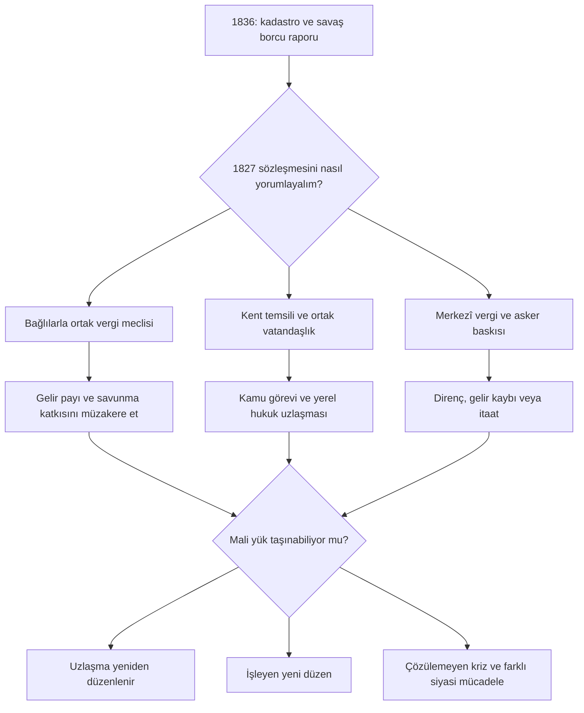
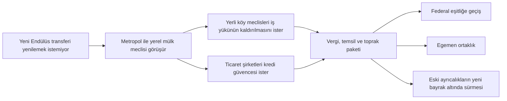

# Hikâye, oyuncu yolculuğu ve görsel kimlik

Bu belge **yazılı anlatı tasarımıdır**. Event/journal kodu, onaylanmış bir Flavor diyagramı veya kullanılmaya hazır GFX değildir. Amaç ileride bir LLM'nin olayları rastgele eklemesini önlemek; neden, aktör, seçenek ve sonucu önce kurmaktır.

## 1. Ortak anlatı kuralları

- 1836'da her büyük krizi aynı gün ateşleme. Bir ülke için bir ana iç mesele, bir dış baskı ve en fazla iki ikincil gündem görünür olsun.
- Koşul ortadan kalktıysa olayın eski muhatabına zorla teslim etme. Antlaşma değişmiş, ülke birleşmiş veya mesele reformla çözülmüşse anlatı bunu kabul eder.
- Savaş, ilhak, din değiştirme veya bağımsızlık tek bir tıklamayla kaçınılmaz sonuç değildir. Hazırlık, muhatap ve bedel gerekir.
- “Reform” her gruba aynı anda kazandırmaz; “gelenek” her durumda bilim düşmanlığı değildir. Oyuncu seçimin kimin gelirini, güvenliğini veya hakkını etkilediğini anlayabilsin.
- İnsanları yalnız üretim bonusu ya da isyan sayacı olarak anlatma. İşçinin ücret, köylünün su/toprak, sömürgeleştirilmiş topluluğun hukuki özne olma talebi olayın konusu olabilir.
- Bir kültürü veya dini aşağılayan anlatıcı sesi kullanma. Ayrımcı devlet propagandası varsa açıkça o aktörün görüşü olarak ver; senaryonun doğrusu olarak sunma.

## 2. On ana anlatının yazılı akışı

| Ülke / ad | Başlangıç koşulu ve ilk sahne | Orta aşama | Birbirinden farklı sonlar |
|---|---|---|---|
| Rûm — İkinci Nizam | Savaş borcu ve 1827 katkı sözleşmeleri mevcut; kadastro raporu gelir | Bağlılarla gelir müzakeresi; kamu görevi ve yerel mahkeme tartışması; grev/arz sorunu | Mali federasyon; anayasal ortak yurttaşlık; zorlayıcı merkezîleşme ve sürekli direnç riski |
| Mısır — Nil ve Minber | Sulama/bakım ile Levant harcaması aynı bütçeyi talep eder | Ulema-vakıf gelirine dokunma, ithal yakıt anlaşması, diplomatik tahkim | Ticari hakem güç; kamu hizmeti reformu; askerî rövanş ve mali risk |
| İsfahan — Şahların Meclisi | Yedi üyeli birlik ve ortak proje teklifinin varlığı | Katkı payı/veto, ortak mahkeme, serbest geçiş | Gerçek federal kurum; zorla merkezîleşme; daha gevşek egemen üyeler ortaklığı |
| Tebriz — Ustanın Hakkı | Konvoy/tarife uyuşmazlığı ve üretim sözleşmeleri | Usta/lisans dolaşımı; çalışan hakkı; sınır tahkimi | Konfederasyonun teknik merkezi; bağımsız ticaret devleti; askerî atölye devleti |
| Endülüs — İki Kıtanın Ahdi | Koloni temsil talebi ve yenilenecek transfer anlaşması | Kölelik/angarya, gelir/tazminat, yerli meclislerin ayrı talepleri | Eşitliğe ilerleyen federasyon; müzakere edilmiş egemen ortaklar; zorlayıcı imparatorluk |
| Britanya — Kömür ve İmtiyaz | Yeni tesisler, yabancı lisans ve eğitim açığı | Patent davası, okul bütçesi, işçi hareketi, taç katkısı | Ortak eğitim-sanayi uzlaşması; imtiyazlı özel sanayi; denizaşırı gelir odaklı dönüşüm |
| Lehistan — Toprağın Yurttaşları | Rûm’dan uyarlanan teknoloji yerli imalatı büyütürken serflik işgücü hareketini engeller | Teknik okul yatırımı, özgür köylü sözleşmesi, malikâne tazminatı, temsil | Genişleyen yurttaşlık ve sanayi; soylu ayrıcalıklarıyla sınırlı teknik kalkınma; askerî imalat devleti |
| Kaşgar — Yolların Bedeli | Ticaret gelirine bağımlılık ve altyapı kredisi teklifi | Gümrük teminatı, vaha su hakkı, yerel geçit meclisleri | Egemen transit kalkınması; dış krediye bağlı büyüme; askerî geçit imparatorluğu |
| Gurkanî — Divanın Sınırları | Sözleşmeli bölgeler ve ortak transit önerisi | Temsil, gelir kaydı, Sih/Bengal/Maratha pazarlığı | Müzakere edilmiş Hint ortaklığı; merkezî hanedan; güçlü sınırlı çekirdek |
| Jiangnan — Nehrin Yetkisi | Nehir bakımı ve iç ticaret sınırları | Ortak fon, kırsal temsil, rakip Çin yönetimleri | Antlaşmalarla birlik; askerî cumhuriyet; bağımsız denizci devlet |

Bu sonlar bütün ülkenin ahlaki değerini belirleyen etiketler değildir. Başarı, sürdürülebilir bir düzen ve oyuncunun açık siyasi amacıyla değerlendirilir. Birbirine rakip ülkelerin aynı krizde kendi söz hakkı olur.

## 3. Ayrıntılı örnek akış: Rûm'un İkinci Nizamı

- İlk rapor borç/katkı sorunu çözülmüşse farklı bir mali değerlendirmeye dönüşür; eski kriz zorla tekrar açılmaz.
- Bağlı devlet oyuncusu kendi katkı ve temsil tercihine sahiptir; üst devlet tek taraflı bütün sonları seçmez.
- Vatandaşlık seçeneği ayrı kültürleri kaldırmaz. Kamu görevi, eğitim dili ve yerel mahkeme hakkı ayrı müzakerelerdir.
- Uzlaşma başarısızlığı otomatik iç savaş değildir; iflas, hükümet değişikliği, antlaşmanın yeniden yazılması veya ancak somut koşullarla silahlı çatışma olabilir.
- Bir yol tamamlanınca sonraki yıllarda aynı ödül tekrar tekrar alınmaz; yeni mesele yeni kurumun maliyeti ve toplumsal sonucudur.

## 4. Üç Minber için ortak çatı

**Açılış:** Levant'taki bir vakfın mal varlığı/vergisi üzerinde anlaşmazlık. Yerel cemaat, Şam yönetimi, Kahire makamı ve dış bağışçı ayrı muhataplardır. Bütün Müslüman ülkeler otomatik savaşa çağrılmaz.

1. **Yerel dosya:** hak, bağış ve idare konusunda birden çok iddia görünür olur. Yalnız yabancı büyük güç konuşmaz.
2. **Hakem seçimi:** Kahire makamı, Kurtuba hukuk heyeti, bölgesel içtihat meclisleri veya yerel karma heyet. Tercihin güvenilirliği geçmiş yardım ve tarafsızlığa bağlıdır.
3. **Maddi yük:** kurumun masrafını kimin karşılayacağı, gelirin eğitime mi başka yere mi gideceği kararlaştırılır.
4. **Sonuç:** yerel kabul ve antlaşmalara riayet varsa itibar; zorlayıcı müdahale veya tutulmayan söz varsa meşruiyet kaybı. Askerî müdahale ancak ilgili bağımsız devletin haklarını gerçekten ihlal eden ayrı aşamada gündeme gelir.

**Uzun vadede:** diploma tanınması, salgın yardımı, hac güvenliği ve mülteci kabulü başka dosyalar açar. Tek bir “minber puanı” bütün dindarlığı veya halkın düşüncesini temsil etmez; ülkelerin siyasi ilişkilerini basitleştiren bir tasarım ölçüsü olacaksa sınırı açıklanır.

## 5. Sömürge anlatısı: kimin bağımsızlığı?

Bağımsız bir koloni, yerli ve köleleştirilmiş insanlara hak vermemişse anlatı bunu başarı propagandasıyla kapatmaz. Buna karşılık yerel topluluklar yalnız mağdur görüntüsü olarak kalmaz; öneri sunabilir, ortaklık yapabilir, reddedebilir.

## 6. Dünya çapında gündelik flavor

Büyük diplomatik zincirler arasına savaş ödülü üretmeyen, dünyayı yaşatan konular yerleştirilir:

- Bir Rûm fabrikasında saat standardı ile lonca dinlenme geleneğinin çatışması.
- İskenderiye tersanesinde farklı dillerde güvenlik talimatı; kazanın sorumluluğu.
- Tebrizli kadın bir alet ustasının lonca kabulü; aile işletmesi ve diploma hakkı.
- Kurtuba'da sömürge gazetesinin ana yurtta basılabilmesi; yayın özgürlüğünün imparatorluk sınırı.
- Bengal'de su baskınına karşı üretici/tüccar sandığının hangi köyü önce destekleyeceği.
- Kumasi'de ithal ucuz kumaşla yerli dokumacının pazarı; tarife bedelini tüketicinin ödemesi.
- Kaşgar'da çok dilli ticaret sözleşmesinin iki farklı çevirisi; eğitim ve yargı.
- Vinland'da yerli anlaşmasının şirket tarafından yanlış kaydedilmesi; yazılı kayıt ile sözlü yetki.
- Jiangnan'da nehir bakımını finanse eden verginin köylü ve büyük ihracatçı arasında dağılımı.

Hiçbiri bütün ülkenin kültürünü/dinini tek olayla değiştiren mekanizma olmayacak. Küçük olaylar büyük bir içerik zincirinin önkoşulu veya sonucu olarak anlam kazanır.

## 7. Görsel kimlik

**Genel dönem:** gelişmiş 18. yüzyıl kurumlarının erken 19. yüzyıl makine üretimiyle karşılaşması. Parlak pirinç, ahşap, dökme demir, kâğıt ve dokuma; cam/çelik gökdelen veya sihirli “steampunk” enerji yok. Bütün İslam coğrafyası aynı çöl, kubbe ve yeşil bayrakla resmedilmez.

| Bölge | Görsel motif | İnsan ve mekân odağı | Kaçınılacak kolay klişe |
|---|---|---|---|
| Rûm | Koyu mavi, bakır, Selçuklu/yerel geometrik düzen; çok katmanlı liman mimarisi | Atölye, meclis, okul, tersane | Osmanlı modelinin yalnız yeniden adlandırılması |
| Mısır | Koyu Nil mavisi, sıcak kireçtaşı, ölçü/sulama çizimleri | Nehir, kâğıt, tersane, vakıf kayıt odası | “Gelenekçi = kirli ve bilgisiz” görsel kodu |
| İran | Çivit, tuğla, yazı/alet ayrıntısı | Hassas imalat, matbaa, bahçe ile su altyapısı | Her şeyin yalnız saray lüksü olarak gösterilmesi |
| Endülüs | Kiremit kırmızısı, koyu turkuaz, ahşap ve basılı sayfa | Çok dilli kent, mahkeme, gemi sigorta odası | Sömürge baskısını gizleyen kusursuz hoşgörü ütopyası |
| Avrupa | Bölgesel taş/ahşap, lonca atölyesi ve yeni kömür isleri | Eski kurumların içine kurulmuş yeni tesis | Her kentte yoksul Orta Çağ dekoru |
| Afrika | Bölgeye özgü şehir, pazar, tekstil ve üretim | Yerel yönetici, üretici, kadın/erkek emek ve aile | Bütün kıtayı tek kabile/tek manzara yapmak |
| Amerika | Yerli kent planı ile yeni iskele/matbaa katmanları | Yerli meclisler, azatlı topluluklar, farklı emek rejimleri | Metropolün mimarisini bütün kıtaya kopyalamak |
| Çin/Hindistan | Yerel üretim ve kayıt kültürü, yeni makinelerin mevcut atölyelere girmesi | Tüccar, çiftçi, mühendis ve saray dışı kurumlar | İslami merkezin pasif ve değişmeyen arka planı |

Bayrak/arma için önce tarihî-kurgusal kullanım gerekçesi yazılacak: hanedan işareti, kent mührü veya birlik simgesi. Bütün Müslüman ülkelere aynı hilal verilmez; bugünkü ulusal bayraklar otomatik geçmişe taşınmaz. Henüz bu belgede seçilmiş nihai arma veya üretilmiş görsel yoktur.

## 8. Yazılı aşamadan sonra hazırlanacak harita seti

| Harita | Cevapladığı soru | Görselde birbirinden ayrılacaklar |
|---|---|---|
| Siyasi egemenlik | Kim gerçekte nereyi yönetiyor? | Doğrudan toprak, bağlı ülke, iddia, liman sözleşmesi |
| Birlik ve bağlılık | Kim hangi şartla kime bağlı? | Ortak taç, konfederasyon, koruma ve koloni |
| Sanayi ve enerji | Fabrikalar nasıl çalışıyor? | Yakıt, beceri, hammadde, liman ve kesintiye açık rota |
| Nüfus ve kimlik | Kim nerede yaşıyor? | Kır/kent, kültür, din/yorum; çoğunluk ve azınlık aynı anda |
| Meşruiyet ağları | Minberler neden etkili? | Okul/burs, ziyaret/vakıf, yardım ve hakemlik; askerî ittifaktan ayrı |
| 1836 krizleri | Oyuncu hangi baskılarla başlıyor? | Aktif savaş olmayan gerilim, iç müzakere, yerel çatışma |

Bu altı harita tasarım gereksinimidir; üretilmiş oyun haritası olarak işaretlenmez. Şimdiki iki Mermaid akışı anlatı önizlemesidir, harita yerine geçmez.
